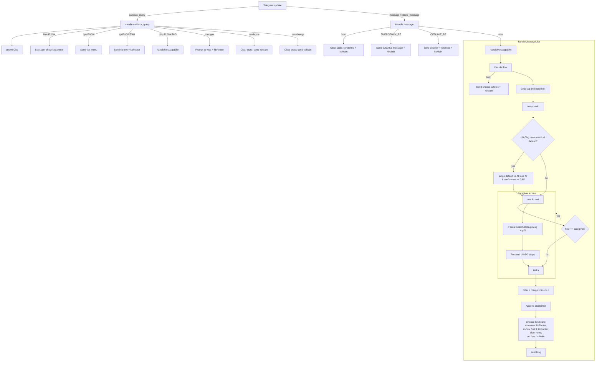

# 🤱 BabyGPT – Smart Chatbot for First-Time Parents in Singapore

## 🍼 Overview

**BabyGPT** is a conversational assistant designed to support **new parents with newborns (0–3 years old)** in Singapore.  
Many first-time parents face overwhelming stress, fragmented information, and conflicting advice during early parenthood. BabyGPT aims to **ease their journey** by providing:

- Reliable, **localized guidance** (e.g., HealthHub, ECDA, LifeSG, MOM links)
- Contextual and **empathetic responses** (not just static text)
- Guardrails for **safety and responsible advice**
- Structured **intent-based flows** to manage different parenting concerns

Additional caregiver features:
- **LifeSG step-by-step guidance** for preschool/infantcare queries, with explicit mention that preschool information is governed by **ECDA**.
- **Area-based infantcare listing**: when users ask for infant care/preschools “in <area>”, the bot lists nearby centres using the **Data.gov.sg** dataset (with graceful fallback when unavailable).

BabyGPT focuses on **providing accurate information and practical steps** rather than overwhelming new parents with excessive online content. It helps them confidently navigate parenthood in their first years.

---

## 🗺️ Mermaid Flowcharts

High‑level update routing and response composition



Menu → flow → chips/tips navigation map

```mermaid
flowchart LR
  MM[🏠 Main menu / kbMain] -->|flow:cry| Cry[🍼 Crying / Sleep]
  MM -->|flow:nutrition| Nut[🥣 Nutrition]
  MM -->|flow:caregiver| Care[👩‍🍼 Caregiving]
  MM -->|flow:wellbeing| Well[🧘 Parental Wellbeing]

  subgraph Cry[cry chips]
    Cry --> Night[🌙 night]
    Cry --> Gas[😣 gas]
    Cry --> Naps[💤 naps]
    Cry --> Bedtime[🧸 bedtime]
  end

  subgraph Nut[nutrition chips]
    Nut --> Solids[🥄 solids]
    Nut --> Milk[🍼 milk]
    Nut --> Meals[🍚 meals]
    Nut --> Allergy[🥜 allergy]
  end

  subgraph Care[caregiver chips]
    Care --> Infantcare[👶 infantcare]
    Care --> MDW[🧹 helper/MDW]
    Care --> Nanny[👩 nanny]
    Care --> TipsBtn[💡 Tips]
  end

  subgraph Well[wellbeing chips]
    Well --> Conflict[🧭 conflicting advice]
  end

  subgraph Tips[tips menu]
    TipsBtn --> Tip1[📝 visit-checklist]
    TipsBtn --> Tip2[📄 ECDA step-by-step]
    TipsBtn --> Back[Back to flow:caregiver]
  end

  %% Chip taps call into one-hop answer with judge (if canonical) then AI
  Night --> HML1[handleMessageLike]
  Gas --> HML2[handleMessageLike]
  Naps --> HML3[handleMessageLike]
  Bedtime --> HML4[handleMessageLike]
  Solids --> HML5
  Milk --> HML6
  Meals --> HML7
  Allergy --> HML8
  Infantcare --> HML9
  MDW --> HML10
  Nanny --> HML11

  %% Navigation buttons
  classDef nav fill:#eef,stroke:#99f,color:#000;
  classDef chip fill:#efe,stroke:#7c7,color:#000;
  class Tip1,Tip2,Back nav;
  class Night,Gas,Naps,Bedtime,Solids,Milk,Meals,Allergy,Infantcare,MDW,Nanny,Conflict chip;
```

---
## ⚙️ Requirements

- Node.js 18+ (uses the global `fetch` and ESM)
- Telegram Bot token (from BotFather)
- OpenAI API key
- Public HTTPS URL reachable by Telegram (e.g., `ngrok`, `cloudflared`, or a hosted domain)

---

## ✨ Flow v2 — What changed

- **Main menu + chips UI**: After choosing a topic (Cry, Nutrition, Caregiving, Parental Wellbeing), you get context-specific chips (subtopics) to narrow the request.
- **Answer Judge (on chip taps only)**: For some chips, the bot has a short, canonical default answer. It also generates an AI answer, then uses a judge to pick the better one (threshold 0.65). Free-typed follow-ups go AI-first without judging.
- **SG link policy**: AI-proposed links are filtered to whitelisted SG domains and merged with curated defaults for the selected flow.
- **Turn-aware footer**: A compact footer with navigation shows for the first few turns in a flow.
- **Tips menu + Type-your-own**: Per-flow quick tips and an explicit "💬 Type my own question" option.
- **Unknown-friendly persona**: When the message doesn’t fit any flow, the bot answers gently (no diagnosis) and shows basic navigation.

New in caregiver flow:
- **LifeSG guidance injection** for preschool/infantcare queries, citing the ECDA step-by-step PDF.
- **Area-based infantcare listing** using the Data.gov.sg childcare dataset (top 5 near the requested area, with graceful fallback if the dataset is unavailable).
- New tip: **📄 ECDA step-by-step**.

## 🚀 Quick Start

1. Install dependencies:

```bash
npm install
```

2. Create `.env` (no trailing slash in `PUBLIC_URL`):

```env
OPENAI_API_KEY=sk-...
TELEGRAM_BOT_TOKEN=123456789:AA...
PUBLIC_URL=https://your-domain-or-tunnel
PORT=3000
```

3. Start the server (dev with watch or prod):

```bash
npm run dev
# or
npm start
```

4. Expose your server (local dev example):

```bash
ngrok http 3000
# then set PUBLIC_URL to the HTTPS ngrok URL (no trailing slash)
```

On boot, if both `PUBLIC_URL` and `TELEGRAM_BOT_TOKEN` are set, the server auto-configures the Telegram webhook to `PUBLIC_URL/telegram/webhook` with `allowed_updates = ["message","callback_query","edited_message"]`.

5. Verify health:

```bash
curl -s http://localhost:3000/health
```

6. In Telegram, open your bot and send `/start`.

---

## 🔧 Configuration (Environment Variables)

- `OPENAI_API_KEY` – OpenAI key used by the bot via the `openai` SDK
- `TELEGRAM_BOT_TOKEN` – Bot token from BotFather
- `PUBLIC_URL` – Public HTTPS base URL (no trailing slash). Used to set the Telegram webhook to `PUBLIC_URL/telegram/webhook`
- `PORT` – Server port (default: `3000`)

`.gitignore` already excludes `.env` and `node_modules`.

---

## 🧠 System Architecture

1. **Telegram Bot** – Main user interface; inline buttons for topical flows.
2. **Express.js Server** – Handles Telegram webhook events, routes intents, and applies safety filters.
3. **OpenAI API** – Used for intelligent summarization, advice, and contextual understanding.
4. **Fallback Rules** – Regex-based intent detection and static guidance if AI is unavailable.

Endpoints:

- `GET /health` → simple healthcheck (`ok`)
- `POST /telegram/webhook` → Telegram webhook receiver

---

## 🛡️ Safety & Guardrails (as implemented)

- Emergency escalation: messages matching severe symptoms (e.g., “blue lips”, “not breathing”, very high fever) trigger an immediate “Call 995 / go to A&E” response.
- Off-limit topics: self-harm, suicide, sexual content, violence, illegal topics, loans/money lending are declined with helpline pointers.
- Explicit disclaimer appended to AI responses: “General info only. For emergencies, call 995.”

---

## 🎯 Intent Handling

- Top-level routing via lightweight regex mapper (`ruleIntentTop`): `cry`, `nutrition`, `caregiver`, `wellbeing`, plus `help` for special handling.
- Flow is sticky per chat (`state` stores `{ flow, turns }`). Selecting a flow from the main menu sets the flow and shows context chips.
- Chip detection inside a flow via regex patterns, or explicit chip selection from the UI.
- For chips with canonical guidance, the bot may pick between the canonical default and AI-generated answer using a judge (see below).

### Response Composition

0. **Caregiver enrichment (preschool/infantcare queries)**:
   - Prepends a short **LifeSG how‑to** (Family & Parenting → Preschool → search by area → filter Service type = Infant care, fees, vacancies → shortlist and visit 2–3 centres), explicitly stating preschool info is governed by **ECDA**.
   - If the user mentions an area (e.g., "in Sengkang"), shows up to **5 nearby centres** via **Data.gov.sg**. Falls back silently if the dataset is unavailable.
1. Compose: The bot calls OpenAI (`gpt-4o-mini`) to compose concise, step-first guidance (≤180 words). System rules emphasise SG context and safety.
2. Judge (when a canonical default exists): Compares canonical vs AI answer and selects the better one if `confidence ≥ 0.65`. If the judge errors (e.g., quota), it uses the canonical default.
3. Links: Extracts URLs from the AI answer, filters to SG whitelisted hosts, and merges with curated defaults per flow. The caregiver defaults include the **ECDA Step‑by‑Step PDF** and **ECDA Preschool Search**.
4. Footer & turns: Shows a small nav footer for the first few turns within a flow; always appends the safety disclaimer.

---

## 🧭 UI & Navigation

- **Main menu**: 4 flows
  - 🍼 Crying / Sleep (`cry`)
  - 🥣 Nutrition (`nutrition`)
  - 👩‍🍼 Caregiving (`caregiver`)
  - 🧘 Parental Wellbeing (`wellbeing`)
- **Context chips** per flow (examples below) to quickly specialise the topic. The Cry flow chips are now: `🌙 Wakes at night`, `😣 Gas / tummy discomfort`, `💤 Day naps`, `🧸 Bedtime routine`.
- **Navigation**: `🏠 Main menu` and `🔄 Change topic` buttons are always available in the context UI, and a compact footer shows during early turns.
- **Tips menu**: Each flow includes a `💡 Tips` submenu with 2–3 quick references.
- **Type-your-own**: `💬 Type my own question` lets users free-type; follow-ups are AI-first.

Caregiver-specific additions:
- Tips include **📄 ECDA step-by-step** (short summary with a link to the PDF).

---

## 🔘 Button Flow Mechanics (Callback UI)

This summarizes how the inline keyboards and callbacks wire the conversation:

- **Main menu (`kbMain`)**
  - Built from `INTENTS` (`cry`, `nutrition`, `caregiver`, `wellbeing`).
  - Each button sends `callback_data = flow:<flow>`.

- **On `flow:<flow>`**
  - Sets a sticky flow in chat `state` → `{ flow, turns: 0 }`.
  - Sends a short prompt plus the **context keyboard** `kbContext(flow)`.

- **Context keyboard (`kbContext(flow)`)**
  - Chip buttons from `INTENTS[flow].chips` → `callback_data = chip:<flow>:<tag>`.
  - Tips entry → `callback_data = tips:<flow>`.
  - `💬 Type my own question` → `callback_data = nav:type`.
  - Footer row: `🔄 Change topic` → `nav:change`, `🏠 Main menu` → `nav:home`.

- **Tips menu (`kbTipsMenu(flow)`)**
  - Each tip → `callback_data = tip:<flow>:<tag>`.
  - Navigation: `⬅️ Back` → `flow:<flow>`, plus `🏠 Main menu`.

- **Chip behavior (`chip:<flow>:<tag>`)**
  - Runs one-hop answer composition with `forcedFlow` and `forcedTag`.
  - If a canonical snippet exists for that chip, a judge compares canonical vs AI and picks the better one (`confidence ≥ 0.65`).
  - Free-typed follow-ups after that go AI-first (no judge).

- **Navigation callbacks**
  - `nav:type`: prompts the user to type their own question and shows the small footer.
  - `nav:home` and `nav:change`: clear `state` and show the main menu again.

- **Typed messages**
  - `/start`: shows intro + main menu.
  - Messages matching emergency/off-limit rules are handled immediately (A&E/helplines).
  - Otherwise routed to `handleMessageLike`:
    - Flow detection: `forcedFlow` → sticky `state.flow` → regex `ruleIntentTop`.
    - Unknown topics use a gentle persona and always show the small footer.

- **Turn-aware footer policy**
  - If the flow is `unknown`: always show the footer.
  - If the user is inside a chosen flow: show the small footer for the first 3 turns; hide it afterwards.
  - If no flow is set yet: show the main menu.

- **Links and local enhancements**
  - “More information” merges filtered AI links with **subtopic-specific defaults** (e.g., ECDA/LifeSG for infantcare; MOM for helper/MDW). Non‑relevant links (like MOM) won’t appear on preschool queries.
  - For caregiver preschool/infantcare queries: a short **LifeSG guide** is prepended; if the user mentions an area, up to 5 **nearby centres** are listed via **Data.gov.sg**.

---

## 🧩 Intent Flow (Conversation Design)

BabyGPT’s logic follows **structured conversation flows**, ensuring users stay within safe and relevant topics.

### 🌟 Starting Point

**Trigger:** `/start`

**Response:**

> “Hi! I'm BabyGPT (Singapore Edition) — your friendly companion for first-time parents of babies aged 0–3.  
> I can help with:  
> 1️⃣ Health & Development – sleep, crying, feeding, milestones  
> 2️⃣ Caregiving Support – infantcare, helper info  
> 3️⃣ Parental Wellbeing – conflicting advice and gentle self-care tips”

**User chooses** from inline buttons:

- 🍼 Crying / Sleep
- 🥣 Nutrition
- 👩‍🍼 Caregiving
- 🧘 Parental Wellbeing

---

### 🧠 Flows, Chips, and Canonical Content

- **Cry / Sleep (`cry`)** chips: `night`, `gas`, `naps`, `bedtime`
  - Canonical snippets exist for all four chips (short, step-first guidance). The `gas` chip covers tummy discomfort/strong crying (non-diagnostic).
  - Default SG links merged in: HealthHub Sleep Basics, KKH Sleep Guide
- **Nutrition (`nutrition`)** chips: `solids`, `milk`, `meals`, `allergy`
  - Canonical snippets exist for `solids`, `milk`, `meals` (AI handles `allergy`)
  - Default SG links merged in: HealthHub diet and recipe pages
- **Caregiving (`caregiver`)** chips: `infantcare`, `mdw` (helper), `nanny`
  - Canonical snippets exist for all three; links: ECDA, LifeSG, MOM
  - For preschool/infantcare queries, replies include a **LifeSG how‑to** and may show **nearby centres** (top 5) using Data.gov.sg when an area is mentioned.
- **Parental Wellbeing (`wellbeing`)** chips: `conflict`
  - No canonical snippet; AI composes concise support and a plan (cite SG guidance; pick one approach; try 3–5 days; review with family). Tips include “Family chat tips” and “Stick to one plan”.
- For unknown topics, the bot replies with a gentle, supportive persona and basic navigation.

Judge selection runs only when a canonical snippet exists for the chosen chip.

---

## 🗺️ Dialog Flow Examples

### Example: Crying & Sleep Path

User: /start  
Bot shows main menu (Cry / Nutrition / Caregiving / Parental Wellbeing)  
⬇️ User taps “🍼 Crying / Sleep” → chips appear (`🌙 Wakes at night`, `😣 Gas / tummy discomfort`, `💤 Day naps`, `🧸 Bedtime routine`)  
⬇️ User taps `😣 Gas / tummy discomfort`  
Bot composes an AI answer, compares with the canonical gas snippet (judge threshold 0.65), and sends the better one.  
Bot appends curated SG links and the standard disclaimer.

### Example: Caregiver Search Path

User: /start → taps 👩‍🍼 Caregiving  
Chips: `👶 Infantcare`, `🧹 Helper / MDW`, `👩 Nanny/Babysitter`  
⬇️ User taps `👶 Infantcare`  
Bot prepends a short **LifeSG guide** (ECDA-governed info, steps to use LifeSG), then replies with the usual answer and ECDA/LifeSG links. If the user asks e.g. "infantcare in Sengkang", it also lists nearby centres (top 5) from Data.gov.sg.

---

## 🧰 Development Notes

- ESM is enabled via `"type": "module"`
- Scripts: `npm run dev` (watch), `npm start`
- Express v5.x; Node 18+ global `fetch` is used (no extra polyfill)
- Inline keyboards: main menu + per-flow chips; small footer appears for early turns within a flow
- Telegram API calls use a retry wrapper (up to 50 attempts) with exponential backoff and support for `Retry-After`; only 429/5xx are retried.

---

## 🔗 SG Links Policy

- AI links are extracted from the model output and filtered to whitelisted SG domains only: `healthhub.sg`, `hpb.gov.sg`, `moh.gov.sg`, `kkh.com.sg`, `ecda.gov.sg`, `life.gov.sg`, `lifesg.gov.sg`, `mom.gov.sg`, `imh.com.sg`, `sos.org.sg`, `gov.sg`, `familiesforlife.sg`, `data.gov.sg`.
- Curated default links per flow are always preferred; filtered AI links are merged on top, deduplicated, and trimmed.
- Unknown flow has safe defaults referencing Families for Life and HealthHub overview pages.
- All replies end with: `_Disclaimer: General info only. For emergencies, call 995._`

---

## 🪛 Troubleshooting

- OpenAI quota exceeded → Bot replies: `[debug] OpenAI API quota exceeded – please check API credits.`  
  Fix: top up credits or change `OPENAI_API_KEY`.
- Webhook not receiving updates → Ensure `PUBLIC_URL` is HTTPS and reachable, server is running, and token is correct. The server sets the webhook on startup; to set manually:

```bash
curl -s -X POST "https://api.telegram.org/bot$TELEGRAM_BOT_TOKEN/setWebhook" \
  -H 'Content-Type: application/json' \
  -d '{"url":"'"$PUBLIC_URL"'/telegram/webhook","allowed_updates":["message","callback_query","edited_message"]}'
```

- 403 from Telegram API → Wrong `TELEGRAM_BOT_TOKEN`.
- Markdown formatting issues in replies → The bot uses `parse_mode: Markdown`.
- WSL2 or local dev → Ensure the tunnel URL is stable and exported in `.env`.
- Node version errors → Use Node 18+.

Caregiver enrichment specifics:
- Data.gov.sg listing not shown → Dataset unavailable or no matches for the area; the bot falls back to LifeSG steps and links.

---
