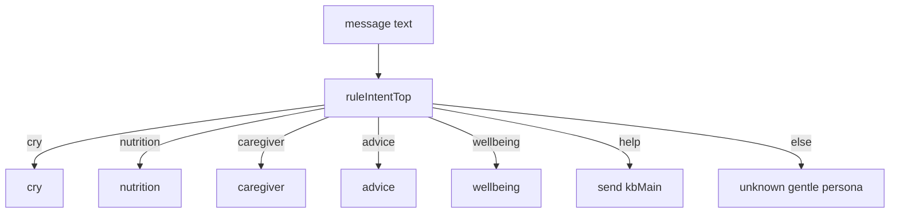
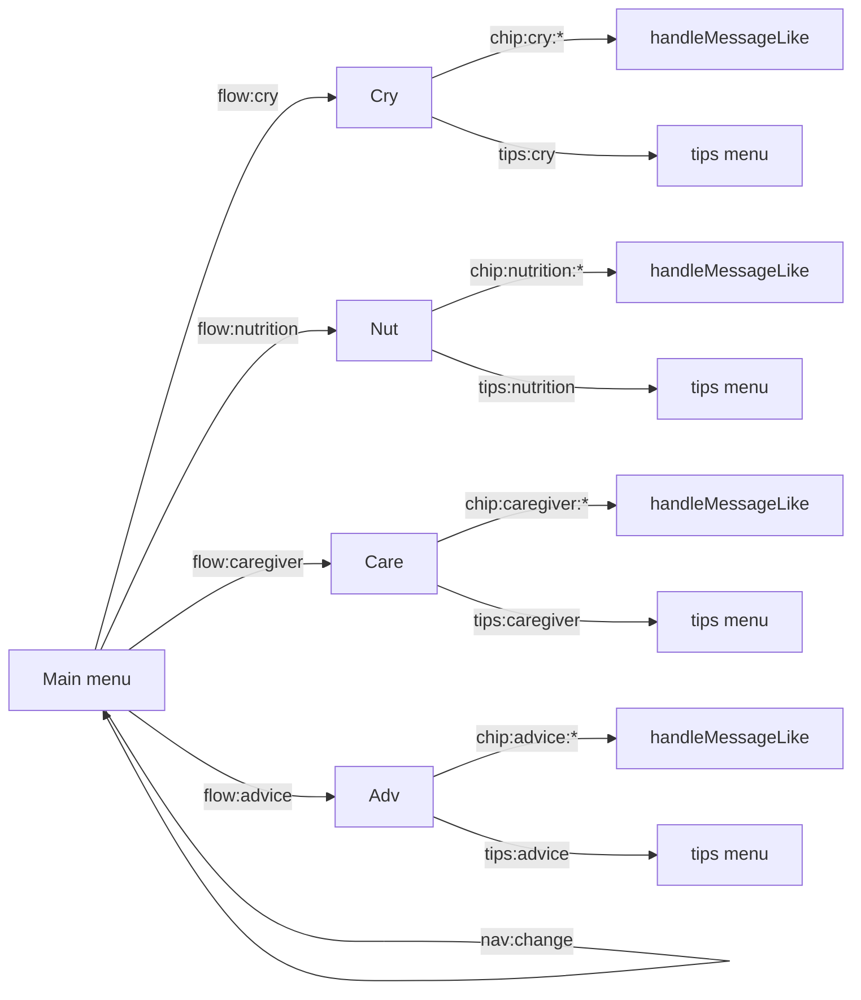

# 🤱 BabyGPT – Smart Chatbot for First-Time Parents in Singapore

## 🍼 Overview

**BabyGPT** is a conversational assistant designed to support **new parents with newborns (0–3 years old)** in Singapore.  
Many first-time parents face overwhelming stress, fragmented information, and conflicting advice during early parenthood. BabyGPT aims to **ease their journey** by providing:

- Reliable, **localized guidance** (e.g., HealthHub, ECDA, MOM links)
- Contextual and **empathetic responses** (not just static text)
- Guardrails for **safety and responsible advice**
- Structured **intent-based flows** to manage different parenting concerns

BabyGPT focuses on **providing accurate information and practical steps** rather than overwhelming new parents with excessive online content. It helps them confidently navigate parenthood in their first years.

---

## ⚙️ Requirements

- Node.js 18+ (uses the global `fetch` and ESM)
- Telegram Bot token (from BotFather)
- OpenAI API key
- Public HTTPS URL reachable by Telegram (e.g., `ngrok`, `cloudflared`, or a hosted domain)

---

## ✨ Flow v2 — What changed

- **Main menu + chips UI**: After choosing a topic (Cry, Nutrition, Caregiving, Conflicting Advice), you get context-specific chips (subtopics) to narrow the request.
- **Simpler answers (no judge in v0)**: Replies are generated directly by the model for both chips and free-typed messages.
- **Links (v0)**: AI-extracted URLs are merged with a small curated set; not strictly SG-only in this branch.
- **Turn-aware footer**: A compact footer with navigation shows for the first few turns in a flow.
- **Tips menu + Type-your-own**: Per-flow quick tips and an explicit "💬 Type my own question" option.
- **Unknown-friendly persona**: When the message doesn’t fit any flow, the bot answers gently (no diagnosis) and shows basic navigation.

## 🚀 Quick Start

1. Install dependencies:

```bash
npm install
```

2. Create `.env` (no trailing slash in `PUBLIC_URL`):

```env
OPENAI_API_KEY=sk-...
TELEGRAM_BOT_TOKEN=123456789:AA...
PUBLIC_URL=https://your-domain-or-tunnel
PORT=3000
```

3. Start the server (dev with watch or prod):

```bash
npm run dev
# or
npm start
```

4. Expose your server (local dev example):

```bash
ngrok http 3000
# then set PUBLIC_URL to the HTTPS ngrok URL (no trailing slash)
```

On boot, if both `PUBLIC_URL` and `TELEGRAM_BOT_TOKEN` are set, the server auto-configures the Telegram webhook to `PUBLIC_URL/telegram/webhook` with `allowed_updates = ["message","callback_query","edited_message"]`.

5. Verify health:

```bash
curl -s http://localhost:3000/health
```

6. In Telegram, open your bot and send `/start`.

---

## 🔧 Configuration (Environment Variables)

- `OPENAI_API_KEY` – OpenAI key used by the bot via the `openai` SDK
- `TELEGRAM_BOT_TOKEN` – Bot token from BotFather
- `PUBLIC_URL` – Public HTTPS base URL (no trailing slash). Used to set the Telegram webhook to `PUBLIC_URL/telegram/webhook`
- `PORT` – Server port (default: `3000`)

`.gitignore` already excludes `.env` and `node_modules`.

---

## 🧠 System Architecture

1. **Telegram Bot** – Main user interface; inline buttons for topical flows.
2. **Express.js Server** – Handles Telegram webhook events, routes intents, and applies safety filters.
3. **OpenAI API** – Used for intelligent summarization, advice, and contextual understanding.
4. **Fallback Rules** – Regex-based intent detection and static guidance if AI is unavailable.

Endpoints:

- `GET /health` → simple healthcheck (`ok`)
- `POST /telegram/webhook` → Telegram webhook receiver

---

## 🛡️ Safety & Guardrails (as implemented)

- This v0 branch uses simplified checks and a lighter disclaimer.
- Explicit disclaimer appended to AI responses: “Note: General information only. For urgent concerns, seek professional help in your area.”

---

## 🎯 Intent Handling

- Top-level routing via lightweight regex mapper (`ruleIntentTop`): `cry`, `nutrition`, `caregiver`, `advice`, plus `wellbeing` and `help` for special handling.
- Flow is sticky per chat (`state` stores `{ flow, turns }`). Selecting a flow from the main menu sets the flow and shows context chips.
- Chip detection inside a flow via regex patterns, or explicit chip selection from the UI.
- In v0, answers are sent directly from the model (no judge step).

## 🗺️ Intent Flow (v0)

Intent routing from free‑typed messages



Callback navigation (buttons)



### Response Composition

1. Compose: The bot calls OpenAI to produce a friendly, light, conversational reply with a few practical ideas (kept reasonably concise).
2. Judge: Not used in v0 — the model’s answer is sent directly.
3. Links: Extracts URLs from the AI answer and merges them with curated defaults; not strictly SG-whitelisted in v0; trimmed to ~6 total.
4. Footer & turns: Shows a small nav footer for the first few turns within a flow; always appends the safety disclaimer.

---

## 🧭 UI & Navigation

- **Main menu**: 4 flows
  - 🍼 Crying / Sleep (`cry`)
  - 🥣 Nutrition (`nutrition`)
  - 👩‍🍼 Caregiving (`caregiver`)
  - 🧭 Conflicting Advice (`advice`)
- **Context chips** per flow (examples below) to quickly specialise the topic. The Cry flow chips are now: `🌙 Wakes at night`, `😣 Gas / tummy discomfort`, `💤 Day naps`, `🧸 Bedtime routine`.
- **Navigation**: `🏠 Main menu` and `🔄 Change topic` buttons are always available in the context UI, and a compact footer shows during early turns.
- **Tips menu**: Each flow includes a `💡 Tips` submenu with 2–3 quick references.
- **Type-your-own**: `💬 Type my own question` lets users free-type; follow-ups are AI-first.

---

## 🧩 Intent Flow (Conversation Design)

BabyGPT’s logic follows **structured conversation flows**, ensuring users stay within safe and relevant topics.

### 🌟 Starting Point

**Trigger:** `/start`

**Response:**

> “Hi! I'm BabyGPT (Singapore Edition) — your friendly companion for first-time parents of babies aged 0–3.  
> I can help with:  
> 1️⃣ Health & Development – sleep, crying, feeding, milestones  
> 2️⃣ Caregiving Support – infantcare, helper info, conflicting advice  
> 3️⃣ Parental Wellbeing – gentle self-care tips”

**User chooses** from inline buttons:

- 🍼 Crying / Sleep
- 🥣 Nutrition
- 👩‍🍼 Caregiving
- 🧭 Conflicting Advice

---

### 🧠 Flows, Chips, and Canonical Content

- **Cry / Sleep (`cry`)** chips: `night`, `gas`, `naps`, `bedtime`
  - Canonical snippets exist for all four chips (short, step-first guidance). The `gas` chip covers tummy discomfort/strong crying (non-diagnostic).
  - Default SG links merged in: HealthHub Sleep Basics, KKH Sleep Guide
- **Nutrition (`nutrition`)** chips: `solids`, `milk`, `meals`, `allergy`
  - Canonical snippets exist for `solids`, `milk`, `meals` (AI handles `allergy`)
  - Default SG links merged in: HealthHub diet and recipe pages
- **Caregiving (`caregiver`)** chips: `infantcare`, `mdw` (helper), `nanny`
  - Canonical snippets exist for all three; links: ECDA, LifeSG, MOM
- **Conflicting Advice (`advice`)** chips: `evidence`, `plan`, `family`
  - No canonical snippet; AI composes with rules to cite SG guidance and propose a trial plan
- Recognised via text (not a button): **`wellbeing`** — AI composes short wellbeing tips; links: IMH, SOS
- For unknown topics, the bot replies with a gentle, supportive persona and basic navigation.

Judge selection runs only when a canonical snippet exists for the chosen chip.

---

## 🗺️ Dialog Flow Examples

### Example: Crying & Sleep Path

User: /start  
Bot shows main menu (Cry / Nutrition / Caregiving / Conflicting Advice)  
⬇️ User taps “🍼 Crying / Sleep” → chips appear (`🌙 Wakes at night`, `😣 Gas / tummy discomfort`, `💤 Day naps`, `🧸 Bedtime routine`)  
⬇️ User taps `😣 Gas / tummy discomfort`  
Bot composes an AI answer and sends it.  
Bot appends curated SG links and the standard disclaimer.

### Example: Caregiver Search Path

User: /start → taps 👩‍🍼 Caregiving  
Chips: `👶 Infantcare`, `🧹 Helper / MDW`, `👩 Nanny/Babysitter`  
⬇️ User taps `👶 Infantcare`  
Bot replies with a concise AI-generated checklist and adds “More information” links.

---

## 🧰 Development Notes

- ESM is enabled via `"type": "module"`
- Scripts: `npm run dev` (watch), `npm start`
- Express v5.x; Node 18+ global `fetch` is used (no extra polyfill)
- Inline keyboards: main menu + per-flow chips; small footer appears for early turns within a flow
- Telegram API calls use a retry wrapper (up to 50 attempts) with exponential backoff and support for `Retry-After`; only 429/5xx are retried.

---

## 🔗 SG Links Policy

- In v0, links extracted from the AI reply are merged with a small curated set and deduplicated (not strictly SG-only).
- Unknown flow has simple defaults.
- All replies end with: `_Note: General information only. For urgent concerns, seek professional help in your area._`

---

## 🪛 Troubleshooting

- OpenAI quota exceeded → Bot replies: `[debug] OpenAI API quota exceeded – please check API credits.`  
  Fix: top up credits or change `OPENAI_API_KEY`.
- Webhook not receiving updates → Ensure `PUBLIC_URL` is HTTPS and reachable, server is running, and token is correct. The server sets the webhook on startup; to set manually:

```bash
curl -s -X POST "https://api.telegram.org/bot$TELEGRAM_BOT_TOKEN/setWebhook" \
  -H 'Content-Type: application/json' \
  -d '{"url":"'"$PUBLIC_URL"'/telegram/webhook","allowed_updates":["message","callback_query","edited_message"]}'
```

- 403 from Telegram API → Wrong `TELEGRAM_BOT_TOKEN`.
- Markdown formatting issues in replies → The bot uses `parse_mode: Markdown`.
- WSL2 or local dev → Ensure the tunnel URL is stable and exported in `.env`.
- Node version errors → Use Node 18+.

---

## 📄 License

ISC
